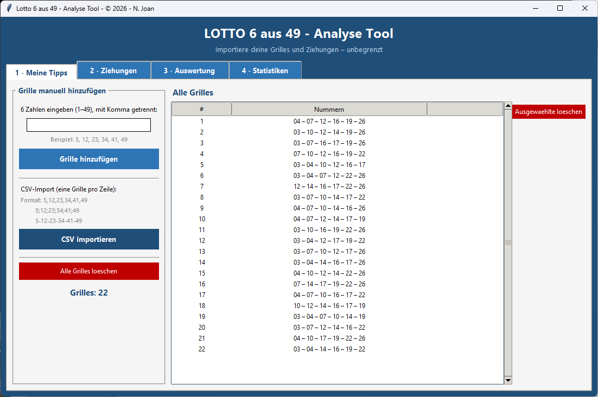
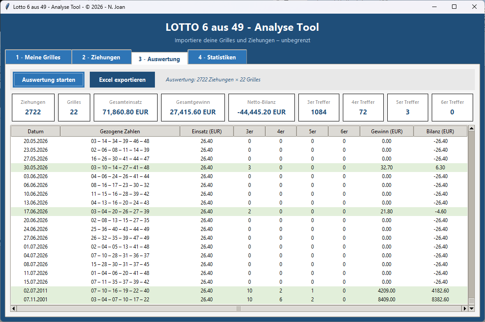
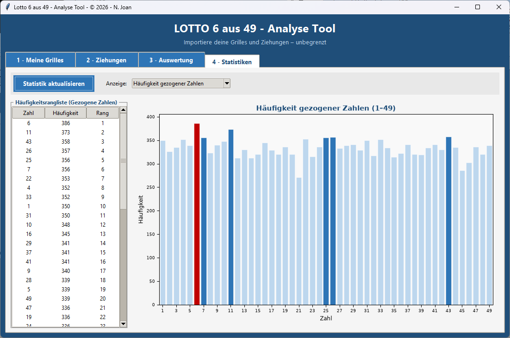

# 🎱 Lotto 6 aus 49 – Analyse Tool

> Importiere deine Tippreihen und Ziehungsergebnisse – unbegrenzt – und werte sie mit einer modernen GUI aus.


---

## 📸 Übersicht

```
┌─────────────────────────────────────────────────────────┐
│  LOTTO 6 aus 49 – Analyse Tool                          │
├──────────────┬─────────────┬──────────────┬─────────────┤
│ 1 - Tipps    │ 2-Ziehungen │ 3-Auswertung │ 4-Statistik │
└──────────────┴─────────────┴──────────────┴─────────────┘
```

---

## ✨ Features

- 📥 **Unbegrenzte Imports** – Grilles und Ziehungen per CSV oder manuell
- 🔢 **Automatische Trennzeichen-Erkennung** – `,` `;` oder `-`
- 📊 **Vollständige Auswertung** – 3er, 4er, 5er, 6er Treffer
- 💶 **Gewinn- und Bilanzberechnung** pro Ziehung
- 📈 **Interaktive Diagramme** – Häufigkeiten, Trefferverteilung, Gewinnverlauf
- 📤 **Excel-Export** mit einem Klick (formatiert, farbig)
- 🗑️ Einzelne Einträge oder alles löschen

---

## 🗂️ Projektstruktur

```
lotto_app/
├── lotto_app.py        # Hauptdatei – App starten
├── tab_grilles.py      # Tab 1: Grilles verwalten
├── tab_ziehungen.py    # Tab 2: Ziehungen verwalten
├── tab_auswertung.py   # Tab 3: Auswertung + Excel-Export
├── tab_statistik.py    # Tab 4: Statistiken + Diagramme
└── README.md           # Diese Datei
```

---

## ⚙️ Installation

### 1. Voraussetzungen

- Python **3.8 oder neuer** → [python.org](https://www.python.org/downloads/)

### 2. Abhängigkeiten installieren

```bash
pip install openpyxl matplotlib
```

> `tkinter` ist in Python bereits enthalten – kein separates Install nötig.

### 3. App starten

```bash
python lotto_app.py
```
## 🖼️ Screenshots


1. Meine Tipps
---


3. Auswertung

---


4. Statistiken

---

## 📋 CSV-Formate

### Tipps (`tab_grilles.py`)

Ein Tipp pro Zeile, 6 Zahlen (1–49). Alle drei Formate werden erkannt:

```csv
# Mit Komma
5,12,23,34,41,49
1,7,8,9,10,11

# Mit Semikolon (z.B. Excel-Export)
5;12;23;34;41;49
1;7;8;9;10;11

# Mit Bindestrich
5-12-23-34-41-49
1-7-8-9-10-11
```

Optional kann eine Header-Zeile vorhanden sein:
```csv
Tipp,Nummern
1,5,12,23,34,41,49
```

---

### Ziehungen (`tab_ziehungen.py`)

Erste Spalte = Datum, danach 6 Zahlen. Unterstützte Formate:

```csv
# 7 Spalten mit Komma oder Semikolon
04.07.2026,7,10,28,31,36,37
27.06.2026;26;32;35;39;47;49

# 2 Spalten: Datum + Zahlen mit Bindestrich
04.07.2026,7-10-28-31-36-37
27.06.2026;26-32-35-39-47-49
```

Unterstützte Datumsformate:

| Format | Beispiel |
|--------|----------|
| `TT.MM.JJJJ` | `04.07.2026` |
| `TT/MM/JJJJ` | `04/07/2026` |
| `JJJJ-MM-TT` | `2026-07-04` |
| `TT-MM-JJJJ` | `04-07-2026` |

---

## 🧮 Gewinnklassen

Die App berechnet Gewinne **ohne Superzahl** mit folgenden Durchschnittswerten:

| Treffer | Gewinnklasse | Ø Gewinn |
|---------|--------------|----------|
| 3 Richtige | Klasse 8 | 10,90 € |
| 4 Richtige | Klasse 6 | 50,00 € |
| 5 Richtige | Klasse 4 | 4.000,00 € |
| 6 Richtige | Klasse 2 | 500.000,00 € |

> ⚠️ Die Gewinne sind **Durchschnittswerte** und variieren je nach tatsächlichem Jackpot und Anzahl der Gewinner.

---

## 📤 Excel-Export

Der Export (Tab 3 → **Excel exportieren**) erstellt eine `.xlsx`-Datei mit:

| Tabellenblatt | Inhalt |
|---------------|--------|
| `Auswertung` | Alle Ziehungen mit Treffern, Gewinn, Bilanz |
| `Meine Tipps` | Deine importierten Tippreihen |

---

## 📊 Statistik-Diagramme (Tab 4)

| Diagramm | Beschreibung |
|----------|--------------|
| **Häufigkeit gezogener Zahlen** | Balkendiagramm aller Zahlen 1–49 |
| **Trefferhäufigkeit deiner Tipps** | 2er bis 6er Treffer im Überblick |
| **Gewinn pro Ziehung** | Balken + kumulierte Bilanzkurve |

---

## 💡 Tipps

- **Mehrfachauswahl** in den Tabellen: `Strg + Klick` oder `Shift + Klick`
- **Löschen** mit der `Entf`-Taste in der Tabelle
- CSV-Dateien aus Excel direkt verwenden (Semikolon wird automatisch erkannt)
- Nach dem Import immer **Tab 3 → "Auswertung starten"** klicken

---

## 📦 EXE-Datei erstellen (Windows)

Du kannst die App mit **PyInstaller** in eine einzelne `.exe`-Datei verpacken, die ohne Python-Installation läuft.

### 1. PyInstaller installieren

```bash
pip install pyinstaller
```

### 2. EXE erstellen

Wechsle in den Ordner mit den Dateien und führe folgenden Befehl aus:

```bash
pyinstaller --onefile --windowed --name "Lotto_Analyse" lotto_app.py
```

| Option | Bedeutung |
|--------|-----------|
| `--onefile` | Alles in eine einzige `.exe` packen |
| `--windowed` | Kein schwarzes Konsolenfenster beim Start |
| `--name "Lotto_Analyse"` | Name der EXE-Datei |

### 3. EXE finden

Nach dem Build liegt die fertige Datei hier:

```
dist/
└── Lotto_Analyse.exe   ← Diese Datei weitergeben
```

> Die Ordner `build/` und `Lotto_Analyse.spec` können danach gelöscht werden.

### 4. Optional: Eigenes Icon hinzufügen

Speichere eine `.ico`-Datei (z.B. `lotto.ico`) im selben Ordner und füge die Option hinzu:

```bash
pyinstaller --onefile --windowed --icon=lotto.ico --name "Lotto_Analyse" lotto_app.py
```

### 5. Hinweis zu Antivirus

Manche Antivirenprogramme blockieren neu erstellte `.exe`-Dateien von PyInstaller.  
Das ist ein **False Positive** – die Datei ist sicher. Du kannst sie in den Ausnahmen deines Antivirusprogramms hinzufügen.

---

## 🛠️ Entwickelt mit

| Bibliothek | Verwendung |
|------------|------------|
| [tkinter](https://docs.python.org/3/library/tkinter.html) | GUI-Framework |
| [openpyxl](https://openpyxl.readthedocs.io/) | Excel-Dateien lesen/schreiben |
| [matplotlib](https://matplotlib.org/) | Diagramme und Charts |

---

## 📄 Lizenz
---
Veröffentlicht unter der MIT-Lizenz. Einzelheiten finden Sie unter [`LICENSE`](LICENSE).
© 2026 - N. Joan.

Dies ist **kein Tool, das Ihre Gewinnchancen erhöht**: Es handelt sich um ein
Tool, das Ihre Zahlen auswertet. Spielen Sie in Maßen.

*Viel Glück beim nächsten Samstag! 🍀*
